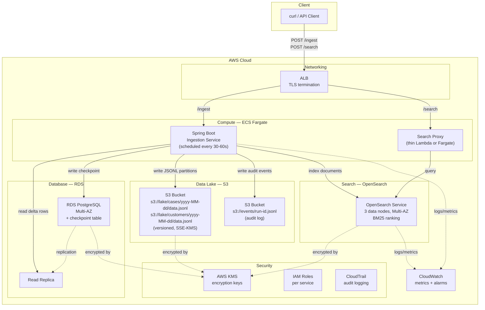
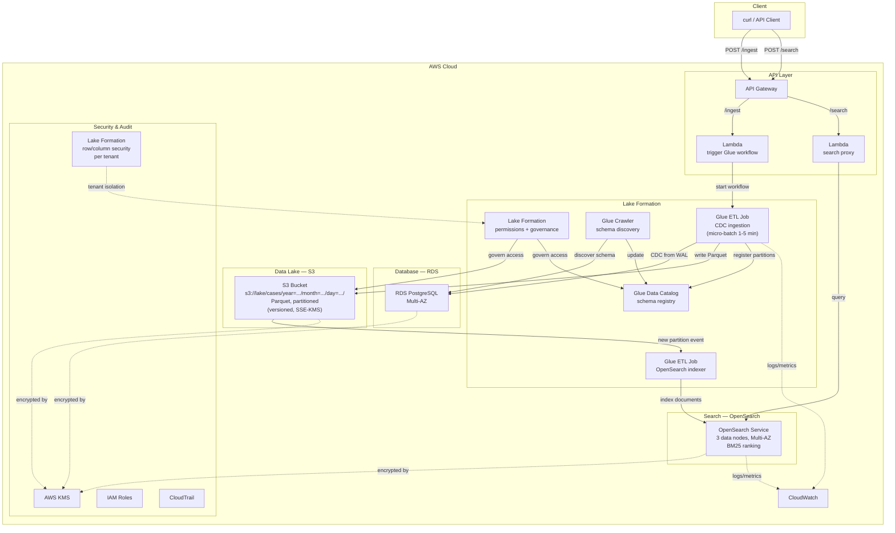
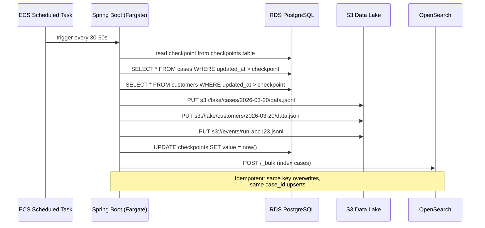
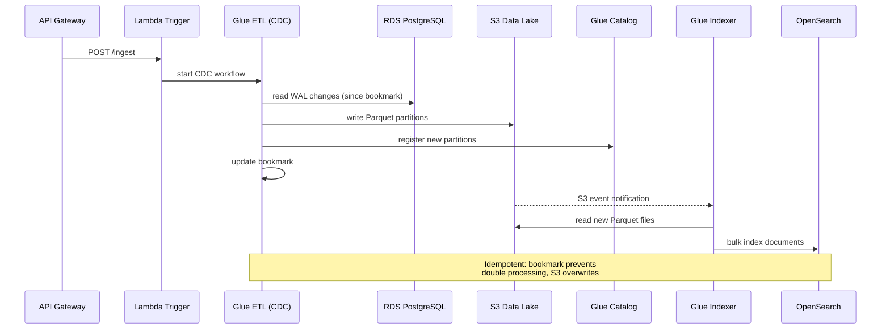
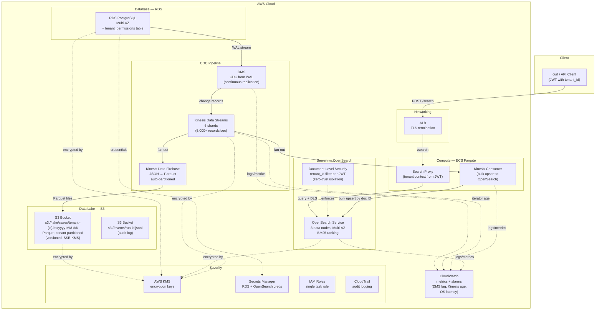
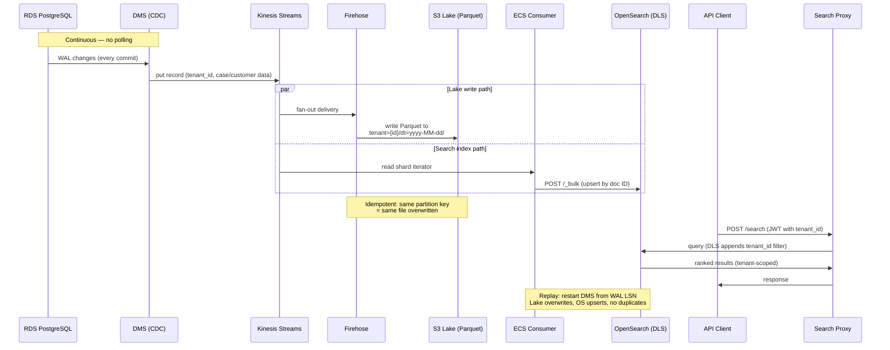
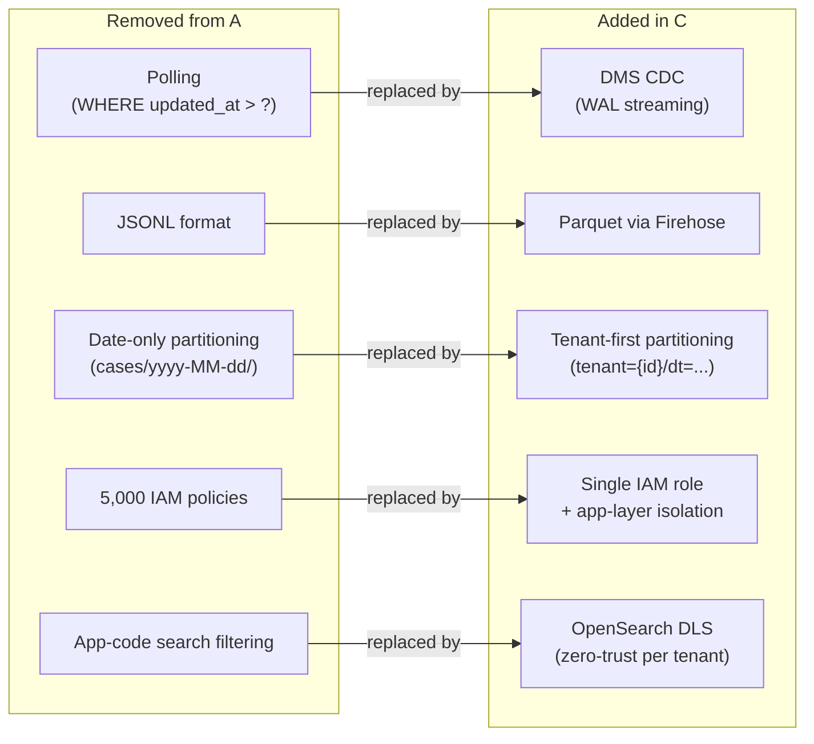

# AWS Architecture Diagrams

## Option A — Custom App on AWS

## Option B — AWS Lake Formation (Managed)

## Data Flow — Option A (Custom App)

## Data Flow — Option B (Lake Formation)

## Option C — Hardened Custom App + Kinesis (Streaming)

## Data Flow — Option C (Hardened + Kinesis)

## Option A → C: What Changed

